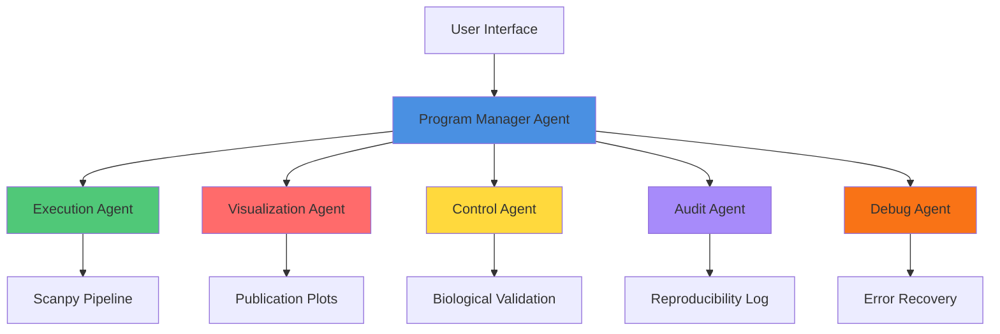

<div align="center">

# 🧬 scRNA-seq Multi-Agent Analysis Platform

### *Intelligent Single-Cell RNA Sequencing Analysis Through Coordinated AI Agents*

[](https://opensource.org/licenses/MIT)
[](https://www.python.org/downloads/)
[](https://www.docker.com/)
[](https://fastapi.tiangolo.com/)
[](https://reactjs.org/)

[Features](#-features) • [Architecture](#-architecture) • [Quick Start](#-quick-start) • [Documentation](#-documentation) • [Contributing](#-contributing)


</div>

---

## 🌟 What is scRNA-seq Multi-Agent Platform?

A **production-ready** single-cell RNA sequencing analysis platform that leverages a sophisticated multi-agent architecture to transform raw sequencing data into publication-quality insights. Upload your data and let our specialized AI agents handle the complete analysis pipeline from quality control to cell type annotation.

### Why Choose This Platform?

<table>
<tr>
<td width="33%" valign="top">

#### 🤖 **Intelligent Agents**
Seven specialized AI agents work in concert, each handling specific aspects of the analysis pipeline with expert-level precision.

</td>
<td width="33%" valign="top">

#### 📊 **Publication Ready**
Generate high-quality visualizations and comprehensive reports ready for scientific publication without manual intervention.

</td>
<td width="33%" valign="top">

#### ⚡ **Real-Time Insights**
WebSocket-powered live updates keep you informed at every step of the analysis process.

</td>
</tr>
</table>

---

## ✨ Features

<details open>
<summary><b>🎯 Core Capabilities</b></summary>

- **Multi-Agent Orchestration**: Coordinated analysis through 7 specialized agents
- **End-to-End Pipeline**: From raw data to annotated cell types
- **Quality Assurance**: Built-in biological validation and reproducibility tracking
- **Interactive Visualizations**: Dynamic, publication-quality plots
- **Scalable Architecture**: Docker-based deployment with Celery task queue
- **Real-Time Progress Tracking**: WebSocket updates for live monitoring

</details>

<details>
<summary><b>🔬 Analysis Modules</b></summary>

| Module | Description |
|--------|-------------|
| **Quality Control** | Comprehensive metrics including MT percentage, gene/UMI counts |
| **Cell Filtering** | Intelligent removal of low-quality cells and doublets |
| **Normalization** | LogNormalize and SCTransform methods |
| **Feature Selection** | Highly Variable Gene (HVG) identification |
| **Dimensionality Reduction** | PCA and UMAP embedding |
| **Clustering** | Leiden and Louvain algorithms |
| **Marker Discovery** | Differential expression analysis |
| **Cell Type Annotation** | Automated annotation using CellTypist |

</details>

---

## 🏗️ Architecture

<div align="center">



</div>

### Agent Roles

| Agent | Responsibility | Technology |
|-------|---------------|------------|
| 🎯 **Program Manager** | Pipeline orchestration and strategic planning | LangChain, OpenAI |
| ⚙️ **Execution Agent** | Executes Scanpy analysis workflows | Scanpy, NumPy |
| 📊 **Visualization Agent** | Generates publication-quality visualizations | Matplotlib, Seaborn |
| ✅ **Control Agent** | Validates biological accuracy and scientific rigor | Domain Knowledge Base |
| 📝 **Audit Agent** | Tracks analysis steps for reproducibility | Logging Framework |
| 🐛 **Debug Agent** | Handles errors and recovery strategies | Exception Handling |
| 🔍 **QC Agent** | Quality metrics and filtering recommendations | Statistical Analysis |

---

## 🚀 Quick Start

### Prerequisites

- Docker & Docker Compose (recommended)
- Python 3.8+ (for local development)
- Node.js 16+ (for frontend development)

### Option 1: Docker (Recommended)

Get up and running in under 2 minutes:

```bash
# Clone the repository
git clone https://github.com/yourusername/scrna-multi-agent.git
cd scrna-multi-agent

# Launch with Docker Compose
docker-compose up --build

# Access the platform
# Frontend: http://localhost:3000
# API Docs: http://localhost:8000/docs
```

### Option 2: Local Development

<details>
<summary><b>Click to expand local setup instructions</b></summary>

**Backend Setup:**
```bash
cd backend
python -m venv venv
source venv/bin/activate  # On Windows: venv\Scripts\activate
pip install -r requirements.txt

# Start FastAPI server
uvicorn app.main:app --reload --port 8000
```

**Celery Worker:**
```bash
# In a new terminal
cd backend
source venv/bin/activate
celery -A app.celery_worker worker --loglevel=info
```

**Redis (required for Celery):**
```bash
# Using Docker
docker run -d -p 6379:6379 redis:alpine

# Or install locally
brew install redis  # macOS
sudo apt-get install redis-server  # Ubuntu
```

**Frontend Setup:**
```bash
cd frontend
npm install
npm run dev

# Access at http://localhost:3000
```

</details>

---

## 📊 Analysis Pipeline

The platform executes a comprehensive 9-step analysis pipeline:

```
Raw Data → QC → Filtering → Normalization → HVG Selection → PCA → Clustering → UMAP → Annotation
```

<details>
<summary><b>Detailed Pipeline Steps</b></summary>

1. **Quality Control** 
   - Calculate mitochondrial gene percentage
   - Count genes and UMIs per cell
   - Generate QC violin plots

2. **Cell Filtering**
   - Remove low-quality cells
   - Filter doublets
   - Apply minimum gene/count thresholds

3. **Normalization**
   - LogNormalize (default)
   - SCTransform (optional)
   - Regress out technical variation

4. **Highly Variable Genes**
   - Identify top variable features
   - Subset data for downstream analysis

5. **PCA**
   - Principal component analysis
   - Elbow plot generation
   - Optimal PC selection

6. **Clustering**
   - Leiden or Louvain algorithms
   - Neighbor graph construction
   - Resolution optimization

7. **UMAP Embedding**
   - 2D visualization
   - Cluster separation analysis

8. **Marker Discovery**
   - Differential expression analysis
   - Top marker identification per cluster

9. **Cell Type Annotation**
   - Automated annotation via CellTypist
   - Confidence scoring

</details>

---

## 🛠️ Technology Stack

<div align="center">

| Layer | Technologies |
|-------|-------------|
| **Backend** | FastAPI, Celery, Redis, Scanpy, AnnData |
| **Frontend** | React, Vite, TailwindCSS, WebSocket |
| **AI/ML** | LangChain, OpenAI, scikit-learn |
| **Visualization** | Matplotlib, Seaborn, Plotly |
| **Infrastructure** | Docker, Docker Compose, Nginx |
| **Database** | Redis (task queue), File-based (results) |

</div>

---

## 📁 Project Structure

```
scrna-multi-agent/
├── 📂 backend/
│   ├── 📂 app/
│   │   ├── 📂 agents/              # Multi-agent system
│   │   │   ├── program_manager.py
│   │   │   ├── execution_agent.py
│   │   │   ├── visualization_agent.py
│   │   │   └── control_agent.py
│   │   ├── 📂 api/                 # FastAPI endpoints
│   │   │   ├── routes.py
│   │   │   └── websocket.py
│   │   ├── 📂 core/                # Core utilities
│   │   ├── main.py                 # Application entry
│   │   └── tasks.py                # Celery tasks
│   ├── requirements.txt
│   └── Dockerfile
├── 📂 frontend/
│   ├── 📂 src/
│   │   ├── 📂 components/          # React components
│   │   ├── 📂 hooks/               # Custom hooks
│   │   ├── App.jsx
│   │   └── main.jsx
│   ├── package.json
│   └── Dockerfile
├── docker-compose.yml
├── README.md
└── LICENSE
```

---

## 📖 Documentation

Comprehensive documentation is available:

- **[User Guide](docs/user-guide.md)** - Complete usage instructions
- **[API Reference](docs/api-reference.md)** - REST API documentation
- **[Agent Architecture](docs/architecture.md)** - Deep dive into agent system
- **[Pipeline Details](docs/pipeline.md)** - Analysis step specifications
- **[Deployment Guide](docs/deployment.md)** - Production deployment

---

## 🤝 Contributing

We welcome contributions! Please see our [Contributing Guidelines](CONTRIBUTING.md) for details.

<details>
<summary><b>How to Contribute</b></summary>

1. Fork the repository
2. Create a feature branch (`git checkout -b feature/amazing-feature`)
3. Commit your changes (`git commit -m 'Add amazing feature'`)
4. Push to the branch (`git push origin feature/amazing-feature`)
5. Open a Pull Request

</details>

---

## 📄 License

This project is licensed under the MIT License - see the [LICENSE](LICENSE) file for details.

---

## 🙏 Acknowledgments

Built with powerful open-source tools:
- [Scanpy](https://scanpy.readthedocs.io/) - Single-cell analysis
- [AnnData](https://anndata.readthedocs.io/) - Annotated data structures
- [LangChain](https://www.langchain.com/) - Agent orchestration
- [FastAPI](https://fastapi.tiangolo.com/) - Modern web framework

---

<div align="center">

### ⭐ Star us on GitHub — it motivates us a lot!

[Report Bug](https://github.com/yourusername/scrna-multi-agent/issues) · [Request Feature](https://github.com/yourusername/scrna-multi-agent/issues) · [Documentation](https://docs.yourplatform.com)

Made with ❤️ by the scRNA-seq Multi-Agent Team

</div>
